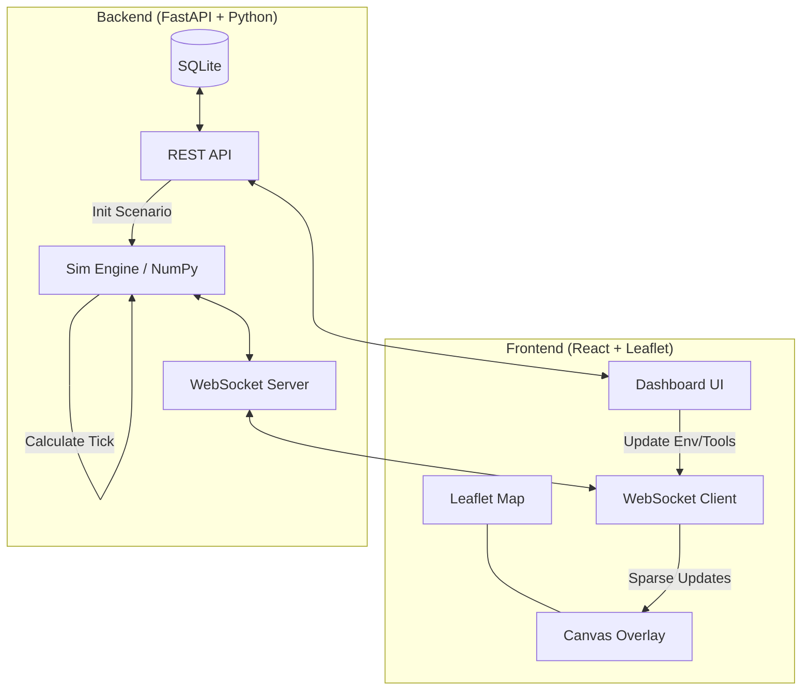
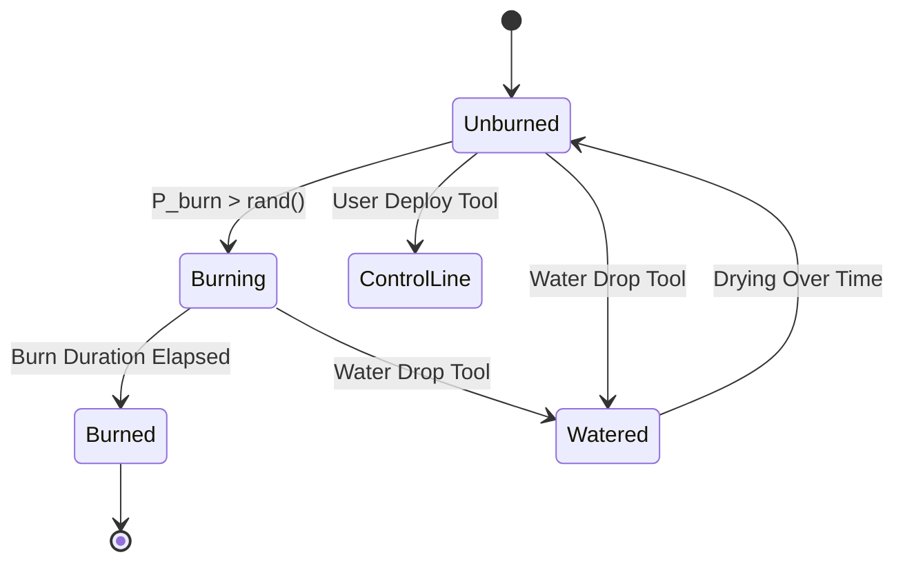
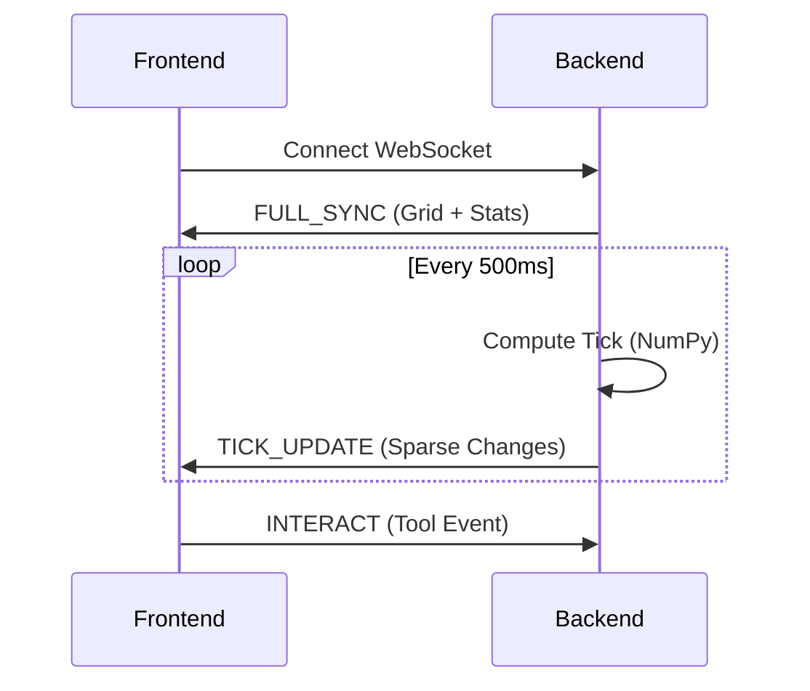

# Palan-Tir of Fire: Wildfire Simulation Training Platform

## 1. Problem Statement

Wildfire spread is rapid and unpredictable, making real-world training for firefighters dangerous and expensive. This platform provides a low-risk, high-fidelity environment to train for wildfire spread scenarios across Australia using simulated data.

## 2. Goals

- **Simulation Engine:** A Python/NumPy-based cellular automata model that calculates fire spread in real-time.
- **Interactive Dashboard:** A React-based UI for visualizing fire spread on a map and interacting with simulation variables.
- **Dynamic Inputs:** Sliders for temperature, humidity, wind speed, and wind direction.
- **Tactical Tools:** Mitigation tools like Water Drops, Control Lines, and Backburns to halt fire spread.
- **Training Metrics:** Real-time stats on hectares burned, structures saved, and overall containment score.

## 3. High-Level Architecture

The platform uses a client-server architecture optimized for low-latency simulation updates:



- **Frontend (React + Leaflet):**
  - **`react-leaflet`**: Renders the base map layers.
  - **HTML5 `<Canvas>` Layer**: A custom overlay that renders the fire grid as glowing particles.
  - **WebSocket Client**: Receives the real-time "Fire Matrix" from the backend.
- **Backend (FastAPI + Python):**
  - **Simulation Engine**: A Python class managing a 2D NumPy array for the fire grid.
  - **WebSocket Server**: Broadcasters the compressed fire state (active fire cell coordinates) to the frontend every 500ms.
  - **REST API**: Handles scenario initialization, resets, and user authentication.

## 4. Simulation Engine (The Grid & Math)

The simulation is a **State-Based Cellular Automata (CA)** model running on a 100x100 grid (extensible to 500x500).

### 4.1. Cell States & Transitions



- **Data Layers:**
  - **Static Layers (Pre-calculated):**
    - **Elevation Map**: 100x100 grid of altitude data.
    - **Slope Layer**: 100x100 grid of pre-calculated uphill gradients (calculated once per scenario load).
    - **Fuel Map**: 100x100 grid of vegetation type and density factors ($P_{veg}, P_{den}$).
  - **Dynamic State Layer:**
    - **Cell State**: `0`: Unburned, `1`: Burning, `2`: Burned, `3`: Control Line, `4`: Watered.

### 4.2. Transition Rules (Alexandridis CA Model)

Each **Unburned** cell calculates its probability of ignition ($P_{burn}$) in every simulation tick:

- $P_{burn} = P_0 \cdot (1 + P_{veg}) \cdot (1 + P_{den}) \cdot P_w \cdot P_s$
- **Constants & Factors**:
  - $P_0 = 0.58$: Base ignition probability.
  - $P_w = \exp(V_{mid} \cdot [0.045 + 0.131 \cdot (\cos(\theta) - 1)])$: Wind factor.
  - $P_s = \exp(0.078 \cdot \text{slope\_angle})$: Slope factor (uphill spread is faster).
- **Moisture Threshold**: If Fuel Moisture (calculated from Temp/Humidity) $> 25\%$, spread stops.

## 5. UI Layout & User Experience

The dashboard is designed for rapid tactical decision-making:

- **Sidebar (Left):**
  - **Atmospheric Sliders**: Real-time control of Temp (0-50°C), Wind (0-100 km/h), and Humidity (0-100%).
  - **Tool Palette**: Icons for Water Drop, Control Line, Backburn, and Evac Zone.
  - **Post-Incident Report**: Real-time stats on fire impact (Hectares burned, Containment score).
- **Map (Right):**
  - A full-screen interactive map with a glowing, flickering fire overlay rendered on a canvas.
  - **Interactivity**: Clicking on the map with an "armed" tool sends the GPS coordinates to the backend to apply mitigation effects.

## 6. API Specification & Data Model

### 6.1. REST API (FastAPI)

- `GET /api/scenarios`: List pre-defined maps.
- `POST /api/simulation/start?scenario_id={id}`: Reset and initialize a global simulation session.
- `PATCH /api/simulation/env`: Update environmental factors (Temp, Wind, Humidity).
- `POST /api/simulation/interact`: Apply a tool (Water Drop, etc.) to GPS coordinates.
- `GET /api/leaderboard`: Top 10 historical scores.

### 6.2. WebSocket Protocol (`/ws/simulation`)

To optimize performance over hackathon Wi-Fi, the platform uses a **Sparse Matrix Update** protocol.



#### 6.2.1. Sparse Update Logic

Instead of sending a 10,000-cell array every 500ms, the backend only broadcasts cell coordinates that have changed state or are currently active.

#### 6.2.2. JSON Message Schemas

- **`FULL_SYNC`**: Sent on connection or reset to hydrate the entire current state.

  ```json
  {
    "type": "FULL_SYNC",
    "grid": [{"x": 10, "y": 20, "s": 1}, ...], // s = state
    "stats": { "burned": 1240, "score": 85 }
  }
  ```

- **`TICK_UPDATE`**: Sent every simulation tick with only state changes.

  ```json
  {
    "type": "TICK",
    "changes": [{"x": 12, "y": 20, "s": 1}, ...],
    "stats": { "burned": 1241, "score": 84 }
  }
  ```

#### 6.2.3. Data Implementation Detail

- **Backend (NumPy)**: Uses `np.where` to find non-zero cells and maps them to concise `{x, y, s}` objects.
- **Frontend (Map)**: Uses a `useRef(new Map())` to store simulation data outside of React state (keyed by `"x,y"`), preventing expensive full-page re-renders while allowing the Canvas to draw efficiently.

### 6.3. Database Schema (SQLite)

- **Table: `scenarios`**: `id`, `name`, `center_lat`, `center_lng`, `initial_fire`, `fuel_map`.
- **Table: `results`**: `id`, `team_name`, `scenario_id`, `score`, `ha_burned`, `timestamp`.

## 7. Team Roles & Milestones

### 7.1. Team Roles (5 People)

- **Role 1 (Sim Engine - BE)**: NumPy fire spread logic and the core tick-loop.
- **Role 2 (API/WS - BE)**: FastAPI server, WebSocket broadcaster, and Tool event handlers.
- **Role 3 (Map/Canvas - FE)**: Leaflet integration and Canvas fire rendering (Glow/Particles).
- **Role 4 (UI/Dash - FE)**: Sliders, Tool selection logic, sidebar, and real-time stats.
- **Role 5 (Data/Pitch - Integration)**: Scenario data, UI polishing, and final pitch presentation.

### 7.2. Hackathon Milestones

- **Hours 0-4**: Scaffolding (FastAPI <-> React WebSocket link working).
- **Hours 4-12**: MVP Simulation (Fire spreads on a static grid).
- **Hours 12-24**: Interactivity (Sliders update $P_{burn}$ and Water Drops work).
- **Hours 24-36**: Polishing (Glow effects, real map locations).
- **Hours 36-48**: Pitch & Presentation preparation.

## 8. Technical Stack

- **Frontend**: React, Leaflet.js, Lucide Icons, Tailwind CSS.
- **Backend**: Python 3.10+, FastAPI, NumPy, Uvicorn, SQLite.
- **Communication**: WebSockets (for the simulation stream).

## 9. Success Criteria

- **Sim performance**: <100ms calculation time per tick for a 100x100 grid.
- **UI Responsiveness**: Fire visuals update smoothly in sync with backend ticks.
- **Training Validity**: Fire spread follows intuitive physical patterns.
