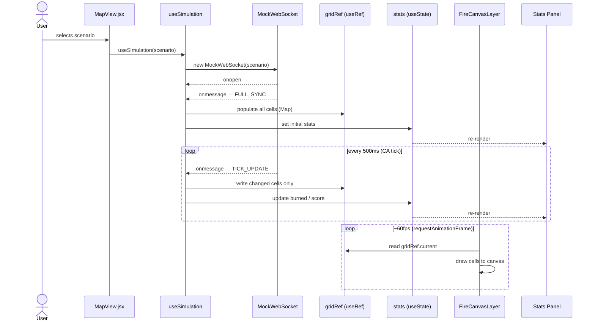
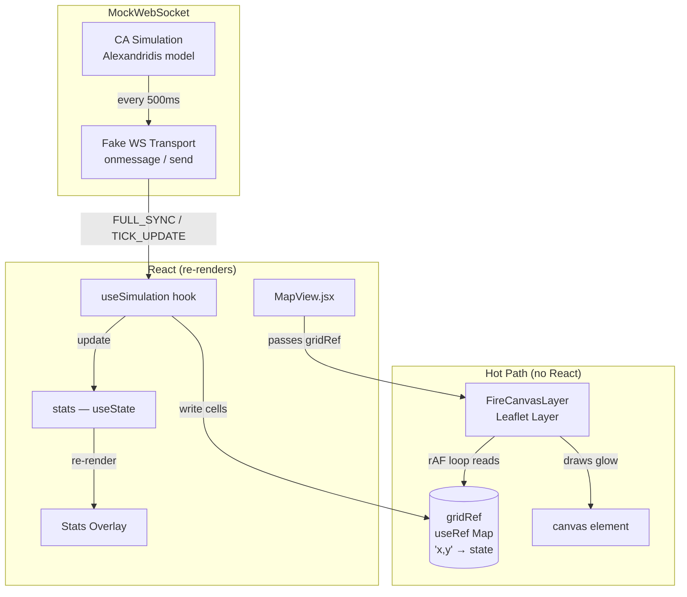

# CLAUDE.md

This file provides guidance to Claude Code (claude.ai/code) when working with code in this repository.

## Project Overview

**FireCommander** — a wildfire simulation platform. Motto: *"Play with fire. Safely."*

**Target Audience:** Kids, teens, and young adults — not professional firefighters. The goal is environmental literacy and basic tactical thinking around wildfire behaviour. UI should be approachable, engaging, and game-like while remaining grounded in realistic fire science.

Users select an Australian wildfire scenario (Blue Mountains, D'Aguilar, Grampians, Kangaroo Island, Lamington, Dandenong Ranges), then practice suppression strategies — control lines, water drops, backburns — on a real satellite map locked to a 10×10km area around the location.

## Commands

### Frontend (in `frontend/`)
```bash
npm run dev       # Start Vite dev server with HMR
npm run build     # Production build
npm run lint      # ESLint
npm run preview   # Preview production build
```

### Backend (repo root)
```bash
uvicorn api:app --reload --port 8000   # Start FastAPI dev server
pip install fastapi uvicorn            # Install deps if needed
```

No test framework is configured yet.

## Architecture

```
frontend/src/         React + Vite (JavaScript/JSX, no TypeScript)
  LandingPage.jsx     Scenario selection grid with ember animation
  MapView.jsx         Full-screen Leaflet map, locked to 10×10km bounds
  data/scenarios.js   6 scenarios with coords, images, risk levels
api.py                FastAPI backend (currently a stub)
```

**Data flow:**
- Frontend → FastAPI via REST (`/api/scenarios`, `/api/simulation/*`) and WebSocket (`/ws/simulation`)
- Backend runs a NumPy cellular-automata simulation (Alexandridis model, 100×100 grid), broadcasts sparse state updates every 500ms
- SQLite stores scenarios and leaderboard results
- Frontend holds fire grid state in `useRef(new Map())` keyed by `"x,y"` — outside React state to avoid re-renders; Canvas reads directly from it

**Simulation model (Alexandridis CA):**
- Cell states: `0` Unburned · `1` Burning · `2` Burned · `3` Control Line · `4` Watered
- Ignition: `P_burn = P₀ · (1 + P_veg) · (1 + P_den) · P_w · P_s` where `P₀ = 0.58`
- Wind factor: `P_w = exp(V · [0.045 + 0.131·(cos(θ)−1)])`
- Slope factor: `P_s = exp(0.078 · slope_angle)`
- Moisture threshold: spread stops if fuel moisture > 25%
- Target: <100ms per tick on a 100×100 grid

**WebSocket protocol:**
- `FULL_SYNC` — full grid + stats on connect/reset
- `TICK_UPDATE` — sparse `{x, y, s}` changes only, every 500ms

## API Endpoints

| Method | Path | Purpose |
|--------|------|---------|
| GET | `/api/scenarios` | List scenarios |
| POST | `/api/simulation/start?scenario_id={id}` | Init/reset simulation |
| PATCH | `/api/simulation/env` | Update temp/wind/humidity |
| POST | `/api/simulation/interact` | Apply tool at GPS coords |
| GET | `/api/leaderboard` | Top 10 scores |

## SQLite Schema

```sql
CREATE TABLE scenarios (id, name, center_lat, center_lng, initial_fire BLOB, fuel_map BLOB);
CREATE TABLE results   (id, team_name, scenario_id, score, ha_burned REAL, timestamp);
```

## Tech Stack
- **Frontend:** React 18, react-leaflet 4, Vite 8, Tailwind CSS v4, Lucide icons
- **Backend:** FastAPI, NumPy, SQLite (raw sqlite3, no ORM), Uvicorn
- **No TypeScript** — pure JSX throughout

## Simulation Data Pipeline

### Sequence — what happens when a scenario loads



### Architecture — who owns what



### Key design rules
- `gridRef` (useRef Map, keyed `"x,y"`) is the bridge between hook and canvas — never goes through React state
- React only re-renders when `stats` changes (every 500ms tick), not on every canvas frame (~60fps)
- `MockWebSocket` mirrors the browser WebSocket API exactly — swapping to `new WebSocket(url)` is one line in `useSimulation`
- `FireCanvasLayer` is transport-agnostic — it only reads `gridRef`, knows nothing about WS or React

### Planned file structure
```
src/
  services/
    MockWebSocket.js      ← CA simulation + fake WS transport
  hooks/
    useSimulation.js      ← owns WS, writes gridRef, updates stats state
  layers/
    FireCanvasLayer.js    ← Leaflet layer, rAF loop, reads gridRef
  MapView.jsx             ← join point: mounts layer, passes gridRef from hook
```

## Fire Visualisation (decided, not yet implemented)

Use **Option 1: HTML5 Canvas + Shadow Glow** rendered as a custom Leaflet layer.

- One `L.Layer` subclass (~30 lines) that owns a `<canvas>` sized to the map container
- Re-draws on Leaflet `moveend` / `zoomend` events using `map.latLngToContainerPoint()` for cell → pixel mapping
- Per burning cell: `ctx.shadowBlur` + `ctx.shadowColor` for glow; fill colour shifts orange → deep red based on `burnAge / BURN_DURATION`
- Burned cells: flat dark charcoal fill, no glow
- Target: <5ms per render pass for a 100×100 grid
- Grid state lives in `useRef(new Map())` keyed by `"x,y"` — written directly by the WebSocket handler, read directly by the canvas — never touches React state to avoid re-renders

Alternatives considered and rejected: DOM/SVG rectangles (no glow, collapses at 100×100), canvas particles/deck.gl (4× render cost, complex, overkill for the audience), image overlay (500ms update lag, `toDataURL` GC pressure).

See `frontend/design_assets/fire-viz-comparison.html` for a live side-by-side demo of all four options.

## Dashboard UI (planned)

- **Left sidebar:** atmospheric sliders (temp 0–50°C, wind 0–100 km/h, humidity 0–100%), tool palette (Water Drop, Control Line, Backburn, Evac Zone), real-time stats
- **Map:** full-screen satellite view with Canvas fire overlay (glowing particles); clicking with an armed tool sends GPS coords to backend
- **Design system:** `frontend/design_assets/design-system.md` — "Tactical Sentinel" dark theme, glassmorphism panels, Manrope + Inter fonts, orange/navy palette
